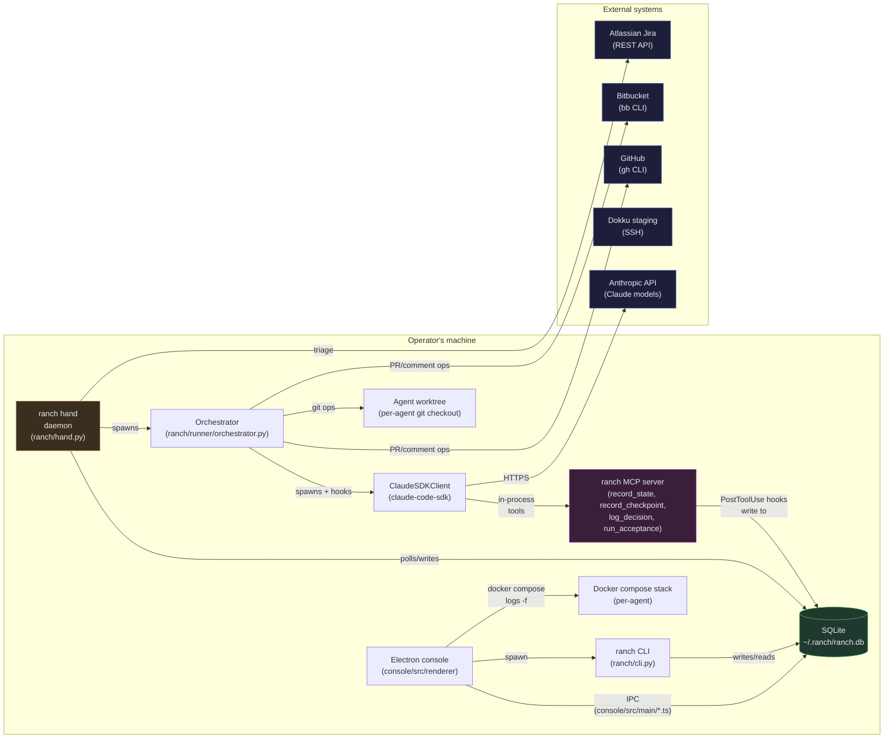
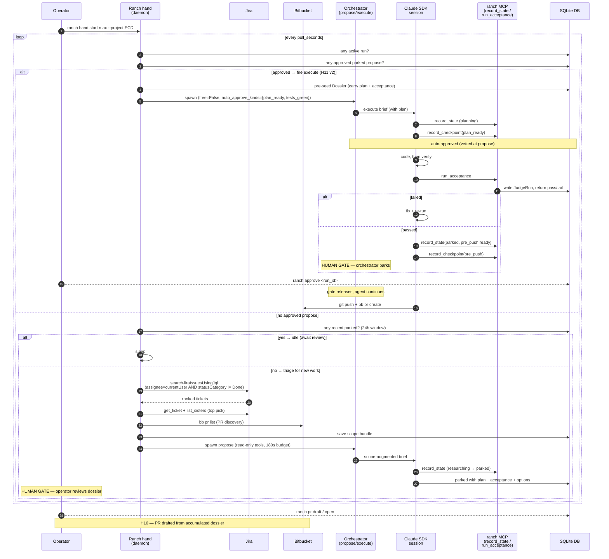
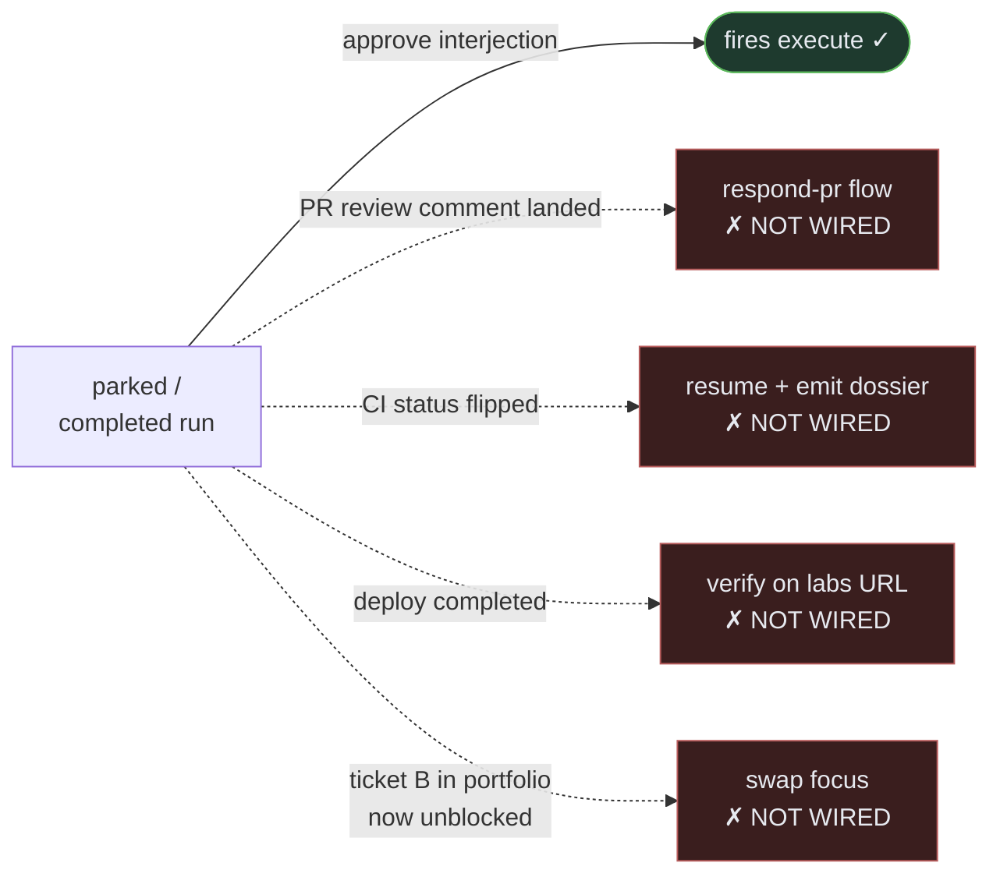
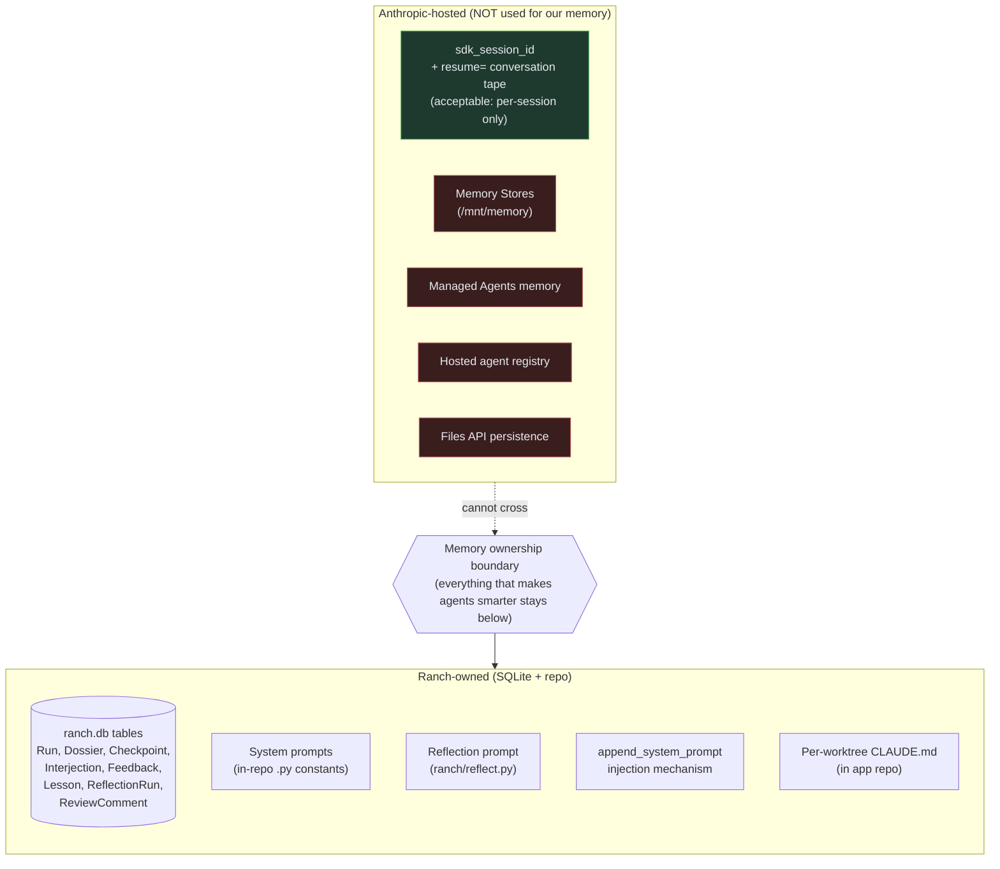
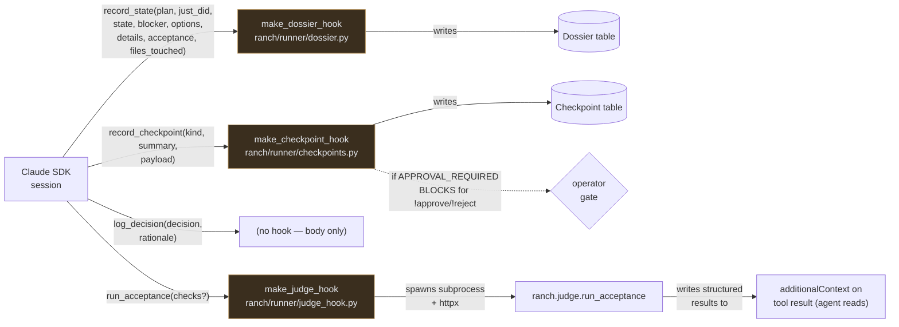
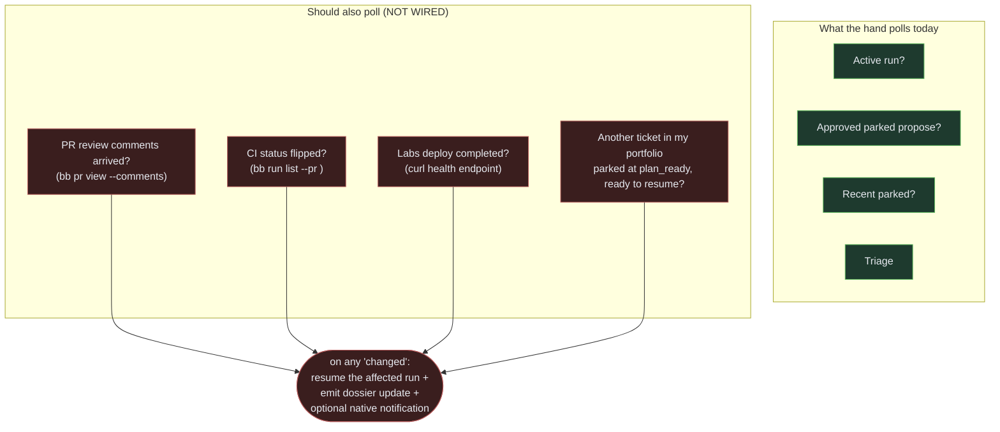

# Ranch — Architecture

A graphical reference for how the autonomous loop is wired, what every
component owns, where state lives, and (importantly) **what's built
today vs. what's still on the board**.

Living document — diagrams update as the system does. If you see a
diagram that doesn't match the code, it's a bug. Open a PR.

---

## At a glance

Ranch is a **memory + orchestration layer above Claude Code**. It doesn't
replace the interactive CC session — it sits around it. Every
persistent fact (lessons, dossier history, decisions, system prompts)
lives in our SQLite DB at `~/.ranch/ranch.db` or in this repo. We
deliberately don't depend on any Anthropic-hosted memory primitive
(see [#92](https://github.com/ethandrower/ranch/issues/92)).

The user-visible product is two surfaces:
- The **Electron console** at `console/` for the operator
- The **`ranch` CLI** for everything the console doesn't surface yet

Behind both: a SQLite DB, a daemon (the **ranch hand**), and a set of
**MCP tools** that ride along inside each Claude SDK session.

---

## 1. Component graph — what runs where



Key relationships:

- **Two writers, one DB.** Both the CLI/hand (Python) and the console
  (Electron main process, via the `sqlite3` binary) read from
  `~/.ranch/ranch.db`. Schema is owned by Python via SQLAlchemy
  (`ranch/models.py`).
- **MCP tools are in-process.** `record_state`, `record_checkpoint`,
  `log_decision`, and `run_acceptance` live in `ranch/runner/tools.py`
  and ride inside every SDK session as `mcp_servers={"ranch": ranch_mcp}`.
- **PostToolUse hooks are how state escapes the session into the DB.**
  Each MCP tool has a matching hook in `ranch/runner/` that validates +
  persists the payload.
- **Anthropic-hosted state is deliberately minimal.** The only thing
  Anthropic holds for us across SDK calls is the session's running
  conversation tape (resumed via `resume=sdk_session_id`). No memory
  stores, no Files API, no hosted agent registry.

---

## 2. Pilot loop — sequence

The full ticket → PR flow with every gate, every hand-off, every
auto-vs-human-approval.



Notes:
- The **PROPOSE → EXECUTE handoff is a structured contract** (the
  parked dossier's `acceptance` field), not freeform markdown. This is
  the whole point of H8.
- **Two operator gates per ticket** — at `plan_ready` (the plan) and
  `pre_push` (the diff). By design. Tune via `auto_approve_kinds` per
  hand if you want to lower it.

---

## 3. Hand decision loop — flowchart

What the hand does on every poll cycle (default every 30s). This is
`RanchHand.run()` in `ranch/hand.py` rendered as a tree.

```mermaid
flowchart TD
  Start([poll tick]) --> Stop{stop sentinel<br/>set?}
  Stop -- yes --> Exit([exit])
  Stop -- no --> Active{any active<br/>run?}
  Active -- yes --> Wait1[idle log<br/>+ sleep]
  Wait1 --> Start
  Active -- no --> Approved{any approved<br/>parked propose?}
  Approved -- yes --> Carry[pre-seed Dossier with<br/>plan + acceptance]
  Carry --> FireExec[spawn Orchestrator<br/>execute mode]
  FireExec --> Start
  Approved -- no --> Recent{recent parked?<br/>(24h window)}
  Recent -- yes --> Wait2[idle log<br/>+ sleep]
  Wait2 --> Start
  Recent -- no --> Triage[ranch triage<br/>--json]
  Triage --> Got{got<br/>candidate?}
  Got -- no --> Wait3[idle log<br/>+ sleep]
  Wait3 --> Start
  Got -- yes --> Scope[ranch scope --save]
  Scope --> Propose[spawn Orchestrator<br/>propose mode]
  Propose --> Park([parked, awaiting<br/>operator review])
  Park --> Start

  classDef built fill:#1e3a2e,stroke:#5cb85c,color:#e6e9ef
  classDef gate fill:#3a2e1e,stroke:#b8945c,color:#e6e9ef
  class Active,Approved,Carry,FireExec,Recent,Triage,Scope,Propose,Got,Stop built
  class Park gate
```

**What's NOT in this loop yet** (would extend the `Approved` branch with
more unblock kinds):



The four dashed paths are the "monitoring for blocks and unblocks"
layer — see **H11 v2 full** (currently issue body of #81) and the
new ticket for unblock-monitoring extensions.

---

## 4. Memory ownership boundary

Where every persistent fact lives. The boundary is enforced by
[#92 (Memory ownership)](https://github.com/ethandrower/ranch/issues/92).
**Anything that makes our agents smarter** — prompts, lessons, dossier
history, decisions — lives below the line. **Anthropic services live
above the line and own nothing across SDK calls except the running
conversation tape.**



The accepted Anthropic surface (`sdk_session_id` + `resume=`) is the
running tape of one SDK call, not "smart memory" the system uses
across sessions. When `ranch hand` re-enters a paused session, it does
so via that resume primitive — which is fine.

If you ever feel tempted to lean on Memory Stores or Managed Agents
memory because they'd save code: **don't**. Write down what you'd put
there as a new SQLAlchemy table or a new column instead. See #92 for
the long version.

---

## 5. MCP tool surface — what the agent sees

Inside every SDK session the agent has these four ranch-specific tools
plus the standard Read/Write/Edit/Bash/Grep/Glob set. Each tool's body
just acknowledges; the **PostToolUse hooks** are where the actual
behavior lives.



Key bits:
- **`record_checkpoint(kind in {plan_ready, pre_push, ...})` BLOCKS** the
  agent's tool call until the operator decides (or `auto_approve_kinds`
  fires). The decision returns as `additionalContext` on the same tool
  result — agent's next turn sees it attached to its own call.
- **`run_acceptance` is non-blocking** but returns pass/fail per check
  in `additionalContext`. Per-session budget guard (default 8 calls)
  prevents iterate-forever loops.
- **`record_state` is purely informational.** The dossier table is the
  primary UI fuel (Confluence-expand timeline per #72).

---

## 6. Status — what's built vs. what's not

| Capability | Status | Where |
|---|---|---|
| Triage assigned Jira tickets, score by viability | ✅ shipped | #74 (PR #86) |
| Scope ticket (epic + sisters + open PRs + design) | ✅ shipped | #75 (PR #87) |
| Bounded propose with structured acceptance | ✅ shipped | #76 (PR #90) |
| Self-judge integration loop (`run_acceptance`) | ✅ shipped | #78 (PR #93) |
| PR draft + open from accumulated artifacts | ✅ shipped | #80 (PR #94) |
| Ranch hand daemon (poll + triage → scope → propose) | ✅ shipped | #81 (PR #91) |
| Hand auto-fires execute on operator approval | ✅ shipped | #81 (PR #95) |
| Dossier schema, MCP tool, persistence, live CLI views | ✅ shipped | #71-72 (PRs #82-84, #88) |
| **Streaming local docker logs in console** | ✅ shipped | #101 (PR #102) |
| PR review feedback loop primitives | ✅ shipped | Phase 5a/5b (pre-H) |
| **PR review polling integrated into hand loop** | ❌ not wired | gap — see new ticket |
| **CI status monitoring (build green/red wake)** | ❌ not built | gap — see new ticket |
| **Labs deploy status monitoring** | ❌ not built | gap — see new ticket |
| **Multi-ticket juggling per hand** | ❌ not built | H11 v2 full (under #81) |
| Console rendering of dossier (Confluence-expand) | ❌ not built | #72 |
| Per-hand kanban swim-lane | ❌ not built | #85 |
| Interactive takeover (pause SDK → claude --resume → hand back) | ❌ not built | #73 |
| Rewind to stage | ❌ not built | #89 |
| Streaming remote Dokku logs | ❌ not built | #101 Phase 2 |
| All five operator-action UI tickets | ❌ not built | #96-100 |

---

## 7. The unblock-monitoring gap — what's actually missing

This is the gap the user keeps hitting:

> "build takes 20 minutes and I switch tasks then forget about it"

Today the hand only knows one unblock kind: the operator hit `ranch
approve`. The intended-but-unbuilt layer:



This is what the **new H20 ticket** scopes — see the ticket body for
the full design.

---

## 8. Pointers

- **Issue epic:** [#70](https://github.com/ethandrower/ranch/issues/70)
  (Ranch hand — self-driving fleet)
- **Memory ownership doctrine:** [#92](https://github.com/ethandrower/ranch/issues/92)
- **UI scope (specced, not built):** #72, #73, #85, #89, #96, #97, #98, #99, #100
- **The CLI surface today** lives in `USAGE.md` (already current with
  the H stack)
- **Roadmap prose** lives in `ROADMAP.md` (Phase H section)

If you're new and want a 5-minute tour: read this file top-to-bottom,
then skim `USAGE.md` for the commands that map to each diagram.
